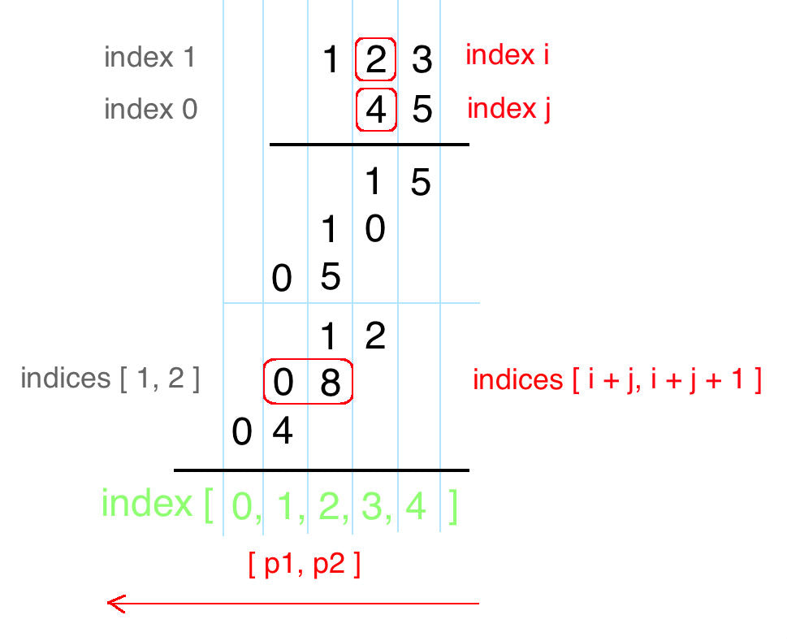

# 43. Multiply Strings
給定兩個代表數字字串，完成兩數相乘並同樣以字串回傳，應避免使用字串轉數字的方式做相乘。

## 解題方法
回歸乘法的原理，個別位數做乘法後相加，所以需要兩個 pointer 去遍歷兩數的所有位數，需注意的是每一輪操作的 index 計算方式如下圖：

在 pointer1 = 1, pointer2 = 0 的情況下，會操作ans陣列的index 1 和 2，由此推導出 每輪 index 的計算方式為[pointer1 + pointer2, pointer1 + pointer2 + 1]


### Step 1 初始化存放答案的陣列

兩數相乘答案位數為兩數位數相加
```
const m = num1.length;
const n = num2.length;
const ans = new Array(m + n).fill(0);
```

### Step 2 個別位數做相乘，同時加上上一輪的進位
```
for(let i = m - 1; i >= 0; i--) {
        for(let j = n - 1; j >= 0; j--) {
            const pointer1 = i + j;
            const pointer2 = i + j + 1;

            const mult = Number(num1[i]) * Number(num2[j]); // 相乘結果
            const sum = ans[pointer2] + mult; // 加上上一輪的進位值
            const carry = Math.floor(sum / 10); // 進位
            const mod = sum % 10;

            ans[pointer1] += carry;
            ans[pointer2] = mod;
        }
    }
```

## 特別注意
```
ans[pointer1] += carry;
```
這一行的結果是有可能超過 10 的，需在下一輪的處理中，將其拿出來相加並計算進位並修正結果：
```
const sum = ans[pointer2] + mult; // 加上上一輪的進位值
const carry = Math.floor(sum / 10); // 進位處理，所以即使上一輪進位超過 10 也沒關係
const mod = sum % 10;

ans[pointer2] = mod; // 修正上一輪的進位結果，此時的pointer2等於上一輪的 pointer1
```